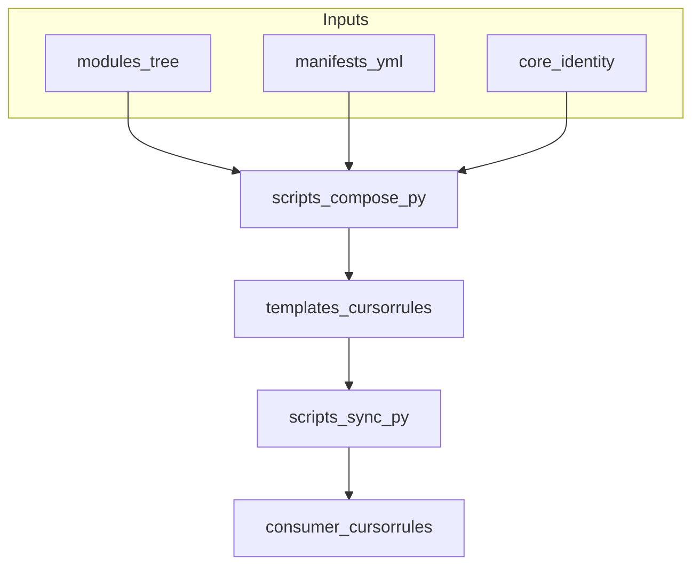

# Architecture

`cursor-rules-hub` builds Cursor rule templates from reusable Markdown modules and YAML manifests. Generated files live under `templates/` and are checked into version control so CI can detect drift.

## Flow

## Single source of truth

| Path | Role |
|------|------|
| `core/identity.md` | Shared preamble; lowest merge priority vs stack modules |
| `modules/**.md` | Reusable sections (level-1 headings only) |
| `manifests/*.yml` | Declares which modules form each template |
| `templates/*.cursorrules` | Generated outputs (do not edit by hand) |

## Manifest schema (v1)

- `version`: must be `1`.
- `core`: optional boolean, default `true`. When `false`, `core/identity.md` is not included.
- `template.id`: slug for the output file `templates/<id>.cursorrules`.
- `template.title`: human-readable title for the generated header comment.
- `priority`: ordered list of blocks. Each block has:
  - `type`: one of `stack-base`, `stack-extension`, `cross-cutting`.
  - `modules`: list of module paths relative to `modules/` **without** `.md` (e.g. `stacks/hono-workers/base`).

## Module contract

- One logical unit per file: `modules/<category>/.../<name>.md`.
- Top-level sections use a single `# Title` line. Nested content uses `##` and deeper; those lines belong to the preceding `#` section.
- No YAML front matter in v1 (keeps parsing simple).

## Merge policy

Layer priority (low → high): `stack-base` < `stack-extension` < `cross-cutting`.  
`core/identity.md` is lower than `stack-base`.

When two sections share the same normalized title (trim, collapsed whitespace), the higher-priority layer wins; within the same layer, the later module in the manifest wins.

Output section order follows the **stream position** of the winning section: as modules are walked in manifest order, each section updates its slot; the final file lists sections by that order index.

## Determinism

- Compose emits a stable header (manifest id, module list fingerprint). No timestamps.
- The same inputs must yield the same `templates/*.cursorrules` bytes.

## Sync

`scripts/sync.py` copies a chosen template into a consumer project’s `.cursorrules` (or a path you pass). It is intentionally small and stdlib-friendly for cross-platform use.
